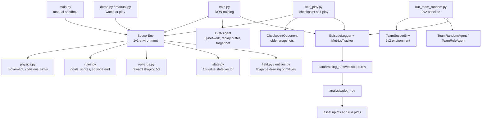

# RLStriker Architecture

RLStriker is organized around a small Gym-style soccer environment, simple baseline agents, DQN training scripts, logging utilities, and analysis tools. The project keeps rendering optional so the same environment can be used for visual demos and fast headless training.

## System Overview

## Runtime Modes

| Mode | Entry Point | Purpose |
| ---- | ----------- | ------- |
| Manual sandbox | `python main.py` | Move both 1v1 players by keyboard and test physics visually |
| Random simulation | `python run_random.py --episodes 100` | Run random baseline agents and produce CSV logs |
| DQN training | `python train.py --episodes 1000` | Train one DQN learner against a random or curriculum opponent |
| Self-play | `python self_play.py --episodes 1000` | Train against random agents and older model checkpoints |
| Demo | `python demo.py --checkpoint <path>` | Watch a saved checkpoint in the Pygame renderer |
| Human vs AI | `python manual.py` | Play against random, weak, strong, latest, or custom checkpoints |
| 2v2 team mode | `python run_team_random.py --episodes 10` | Exercise the team environment with baseline team agents |

## 1v1 Environment Loop

`SoccerEnv.step(action_1, action_2)` applies one tick of soccer logic:

1. Convert discrete actions into movement or kick intent.
2. Apply kick attempts and entity physics.
3. Detect goals or max-step episode termination.
4. Build reward components from goals, touches, progress, steals, positioning, energy, and poor actions.
5. Return `state, reward_1, reward_2, done, info`.

Rendering is controlled by `render_mode`. Training scripts use `render_mode=None` for headless speed, while `main.py`, `demo.py`, and `manual.py` use `render_mode="human"` for Pygame visualization.

## Learning Stack

The current learner is a compact DQN:

- `agents/model.py` defines the Q-network.
- `agents/replay_buffer.py` stores transitions for off-policy learning.
- `agents/dqn_agent.py` manages epsilon-greedy action selection, optimization, target-network syncing, checkpoint saving, and checkpoint loading.
- `agents/checkpoint_opponent.py` loads saved models as frozen opponents for demo and self-play.

The main 1v1 state vector has 18 values, including player positions, ball position and velocity, distance and angle to the ball, ball distance to each goal, directional ball movement, last-touch owner, and current step count.

## Data Flow

Every training or simulation run creates a timestamped or named folder under `data/training_runs/`. The important files are:

| File | Purpose |
| ---- | ------- |
| `config.json` | Run settings, environment size, model settings, reward version, and curriculum/self-play settings |
| `episodes.csv` | One row per episode with scores, rewards, events, behavior metrics, reward components, and epsilon |
| `steps.csv` | Optional large per-step log when `--log-steps` is enabled |
| `checkpoints/*.pt` | Saved PyTorch model snapshots |
| `plots/*.png` | Generated analysis charts |

The `analysis` package reads `episodes.csv` and produces graph assets for rewards, win rate, goals, touches, distance to ball, episode length, and epsilon decay.

## Extension Points

- Add new observations in `env/state.py`, then update DQN input sizes through newly trained checkpoints.
- Add or rebalance shaped rewards in `env/rewards.py`, keeping component logs visible in `episodes.csv`.
- Add new training schedules in `curriculum/stages.py` and `curriculum/curriculum_manager.py`.
- Expand 2v2 behavior through `env/team_soccer_env.py` and `agents/team_agent.py`.
