# RLStriker

RLStriker is a 2D 1v1 soccer reinforcement learning environment built with Python, Pygame, PyTorch, pandas, and matplotlib.

The project is being built version by version. The current version is **V10**, which adds a richer state representation on top of the existing environment, rewards, logging, random agents, DQN training pipeline, graph generation tools, and curriculum learning.


## Current Features

- Pygame soccer pitch with two players, one ball, and two goals
- Manual keyboard control for both players
- Ball physics: friction, wall bounce, player collision, and kick action
- Episode rules: goal detection, score tracking, max-step termination
- Gym-style environment API: `reset()`, `step()`, `render()`, `close()`
- Headless simulation for faster training
- Random baseline agents
- Episode-level CSV logging and optional step-level CSV logging
- Reward shaping V1
- DQN agent with:
  - PyTorch Q-network
  - Replay buffer
  - Target network
  - Epsilon-greedy exploration
  - Checkpoint saving
- Training analysis scripts that generate PNG graphs from `episodes.csv`
- Curriculum learning stages for easier DQN skill progression
- V10 state vector with distance, angle, goal-distance, ball-direction, and last-touch features

## Project Status

| Version | Status | Summary                                       |
| ------- | ------ | --------------------------------------------- |
| V1      | Done   | Basic Pygame soccer field                     |
| V2      | Done   | Physics, kicking, goals, score, episode timer |
| V3      | Done   | Gym-style environment                         |
| V4      | Done   | Random agents                                 |
| V5      | Done   | Episode logging                               |
| V6      | Done   | Simple reward shaping                         |
| V7      | Done   | Basic DQN training pipeline                   |
| V8      | Done   | Training dashboard graphs                     |
| V9      | Done   | Curriculum learning                           |
| V10     | Done   | Better state representation                   |

Next planned version: **V11 - Self-play against older checkpoints**.

## Installation

```bash
git clone https://github.com/gkxvall/RLStriker.git
cd RLStriker
python -m venv .venv
source .venv/bin/activate
pip install -r requirements.txt
```

On Windows:

```bash
.venv\Scripts\activate
pip install -r requirements.txt
```

## Manual Play

```bash
python main.py
```

Controls:

| Player         | Move                 | Kick    |
| -------------- | -------------------- | ------- |
| Blue / agent 1 | `WASD` or arrow keys | `Space` |
| Red / agent 2  | `I J K L`            | `Enter` |

Reset the episode with `R` or the reset button.

## Random Self-Play

Run two random agents and save episode logs:

```bash
python run_random.py --episodes 100
```

Useful options:

```bash
python run_random.py --episodes 50 --run-name random_v6_baseline
python run_random.py --episodes 10 --render
python run_random.py --episodes 10 --log-steps
```

## DQN Training

Train a DQN agent against a random opponent:

```bash
python train.py --episodes 500
```

Train agent 2 instead of agent 1:

```bash
python train.py --episodes 500 --train-agent 2
```

Render training visually:

```bash
python train.py --episodes 20 --render
```

Use a custom run name:

```bash
python train.py --episodes 1000 --run-name dqn_agent1_v7
```

Train with curriculum learning:

```bash
python train.py --episodes 1000 --curriculum --run-name curriculum_agent1_v9
```

Use custom episode counts for the five curriculum stages:

```bash
python train.py --episodes 1000 --curriculum --curriculum-stage-episodes 100,150,200,250,300
```

Useful training options:

| Option                        |      Default | Description                                   |
| ----------------------------- | -----------: | --------------------------------------------- |
| `--episodes`                  |        `500` | Number of episodes                            |
| `--train-agent`               |          `1` | Which side learns, `1` or `2`                 |
| `--checkpoint-every`          |        `100` | Save a model every N episodes                 |
| `--learning-rate`             |      `0.001` | Adam learning rate                            |
| `--gamma`                     |       `0.99` | Discount factor                               |
| `--epsilon-start`             |        `1.0` | Initial exploration rate                      |
| `--epsilon-min`               |       `0.05` | Minimum exploration rate                      |
| `--epsilon-decay`             |      `0.995` | Episode-level epsilon decay                   |
| `--batch-size`                |         `64` | Replay batch size                             |
| `--buffer-size`               |      `50000` | Replay memory capacity                        |
| `--curriculum`                |          off | Enable curriculum learning                    |
| `--curriculum-stage-episodes` | split evenly | Episode counts for the five curriculum stages |
| `--log-steps`                 |          off | Save optional `steps.csv`                     |
| `--render`                    |          off | Open the Pygame window                        |

## Curriculum Learning

Curriculum learning adds an optional staged training path. The goal is to teach the agent small soccer skills before asking it to survive a full match.

| Stage | Name                 | Opponent      | Training focus                                      |
| ----: | -------------------- | ------------- | --------------------------------------------------- |
|     1 | Reach the Ball       | None          | Move toward the ball and touch it                   |
|     2 | Push Toward Goal     | None          | Touch the ball and move it toward the opponent goal |
|     3 | Score Goals          | None          | Use normal goal rewards with scoring enabled        |
|     4 | Weak Random Opponent | Weak random   | Add light pressure from an opponent                 |
|     5 | Self-Play Mirror     | Current model | Play against the learner's current policy           |

Curriculum runs still write the same `episodes.csv`, checkpoints, and optional `steps.csv` files. The run `config.json` includes the full curriculum schedule.

## Training Graphs

Generate all V8 graphs for a saved run:

```bash
python -m analysis.plot_all --run-dir data/training_runs/dqn_agent1_v7
```

By default, plots are saved to:

```text
data/training_runs/<run_name>/plots/
```

Generated files:

```text
plots/
├── rewards.png
├── winrate.png
├── goals.png
├── touches.png
├── distance_to_ball.png
├── episode_length.png
└── epsilon.png
```

You can run individual plot scripts too:

```bash
python -m analysis.plot_rewards --run-dir data/training_runs/dqn_agent1_v7
python -m analysis.plot_goals --run-dir data/training_runs/dqn_agent1_v7
python -m analysis.plot_winrate --run-dir data/training_runs/dqn_agent1_v7
python -m analysis.plot_touches --run-dir data/training_runs/dqn_agent1_v7
```

Useful graph options:

| Option         |           Default | Description                           |
| -------------- | ----------------: | ------------------------------------- |
| `--run-dir`    |          required | Folder containing `episodes.csv`      |
| `--output-dir` | `<run-dir>/plots` | Where PNG files are saved             |
| `--window`     |             `100` | Rolling average window                |
| `--show`       |               off | Open an interactive matplotlib window |

## Training Run Visualizations

These charts compare the first DQN training run, where `agent1`was trained and `agent2` was left on `randomMode`, with the newer `agent2` run created after the V10 state representation improvements.
Each run used 1k episodes of 1k steps, which makes up to `1 MILLION` iterations per run. The first run completed in around 2.5 mins on an `Apple arm M3` proccesor, which proves the efficiency of the algorithms.

Note: `agent1` used the earlier 9-value state vector, while `agent2` used the newer 18-value V10 state vector. This makes the plots useful for progress tracking, but not a perfectly controlled A/B test.

| Metric           | agent1 run                                                                                  | agent2 V10 run                                                                              |
| ---------------- | ------------------------------------------------------------------------------------------- | ------------------------------------------------------------------------------------------- |
| Rewards          | 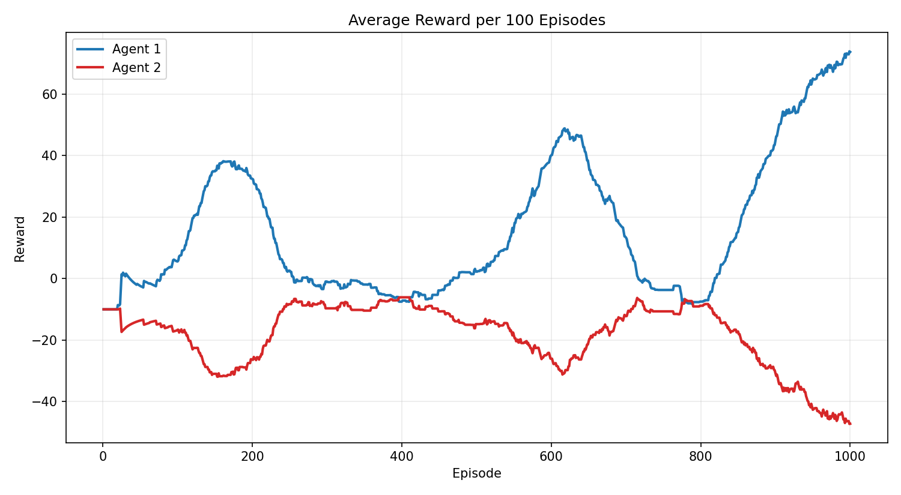                            | 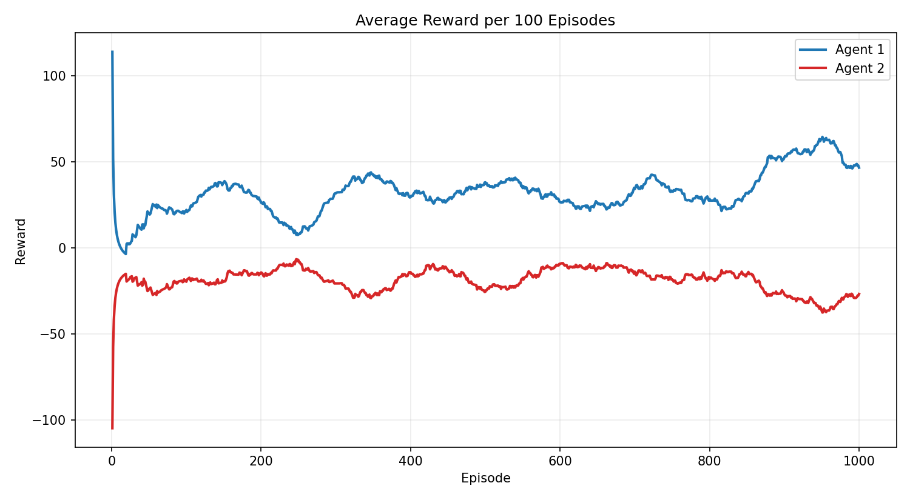                            |
| Win Rate         | 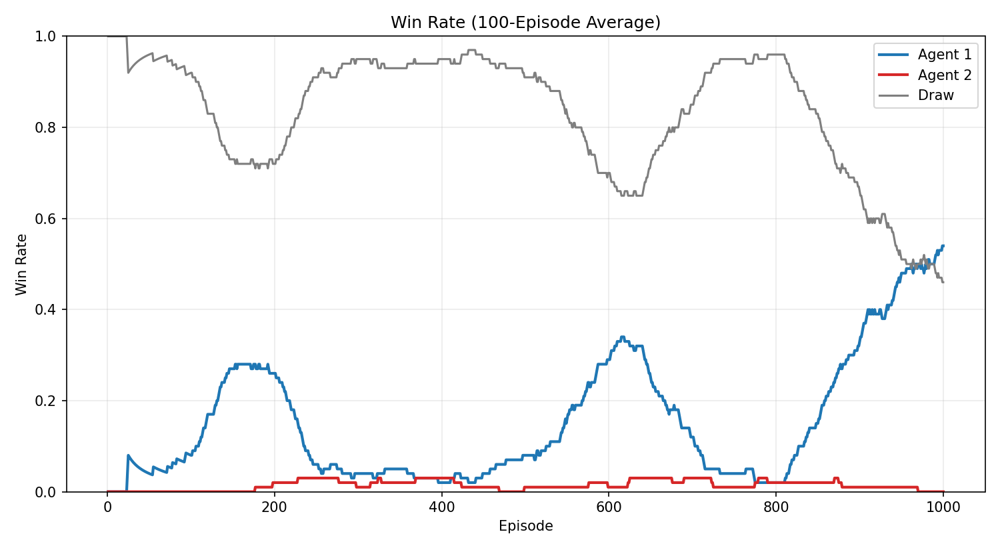                          | 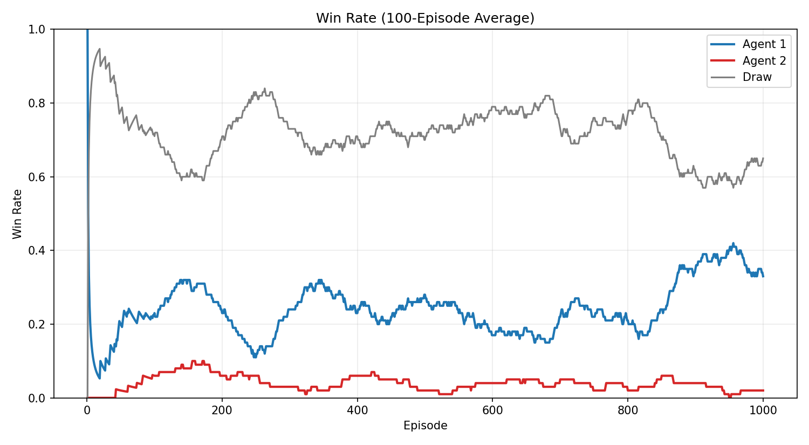                          |
| Goals            | 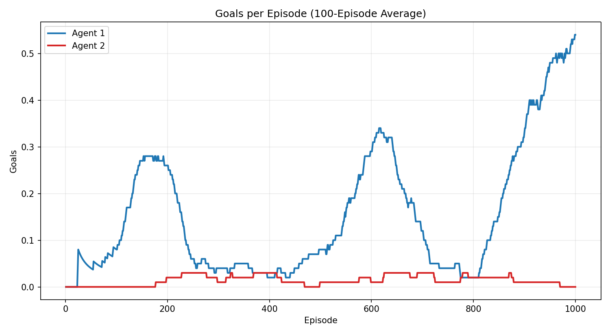                               | 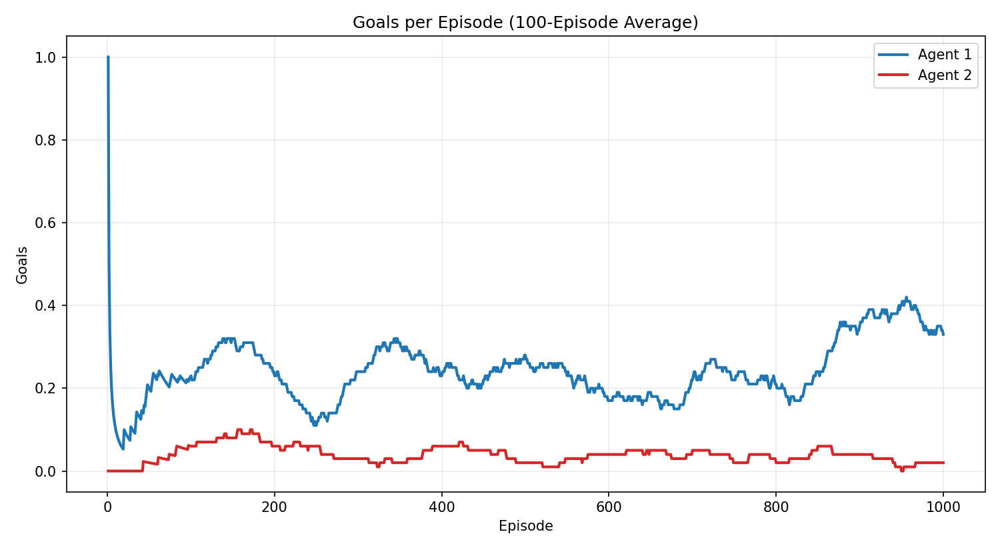                               |
| Ball Touches     | 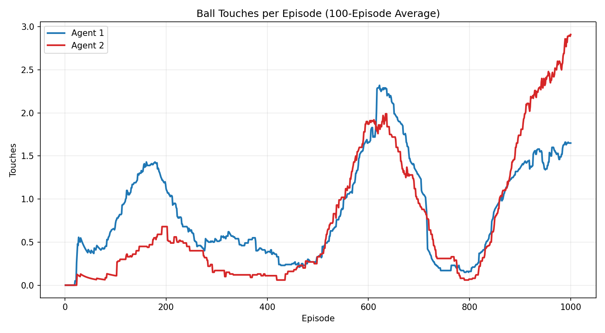                      | 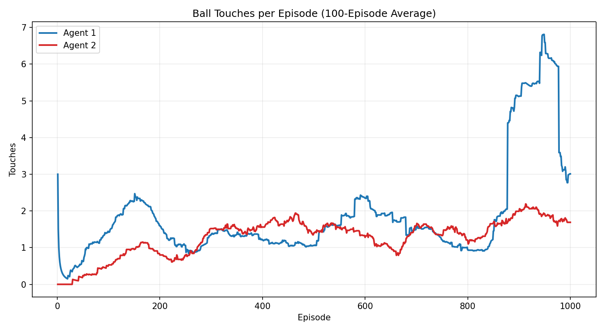                      |
| Distance to Ball | 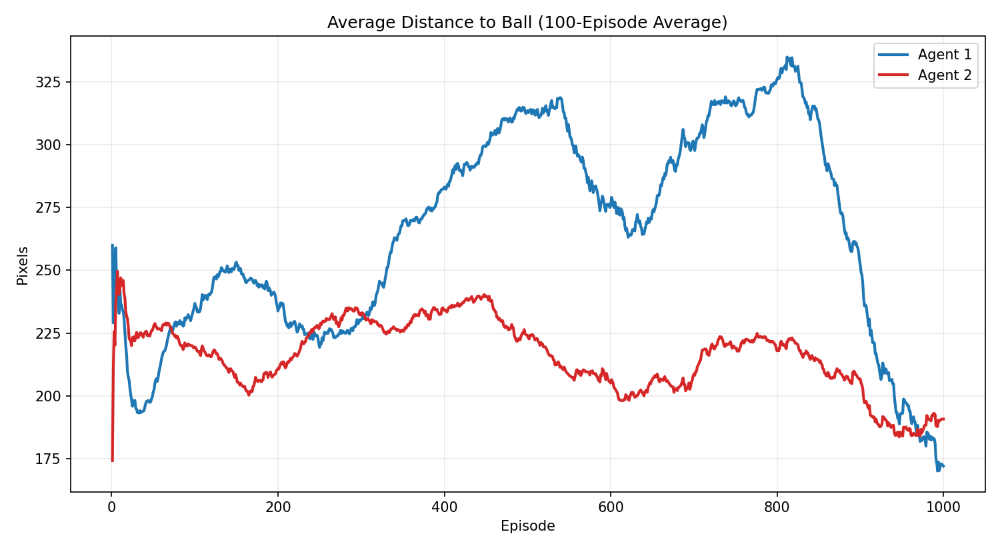 | 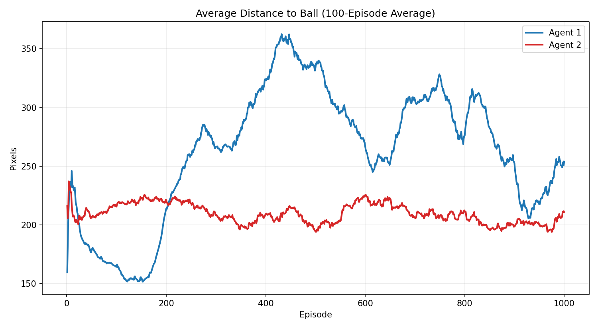 |
| Episode Length   | 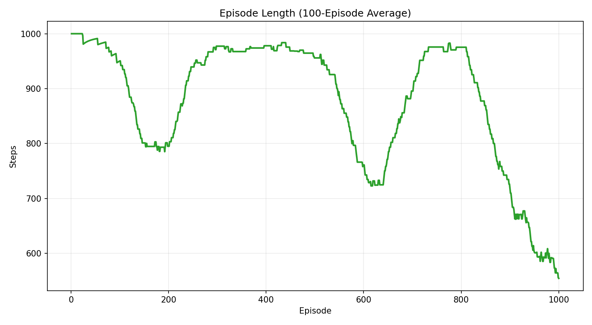             | 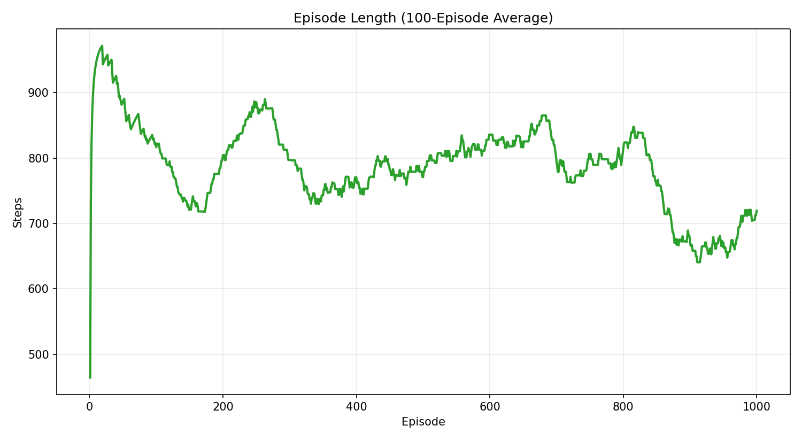             |
| Epsilon Decay    | 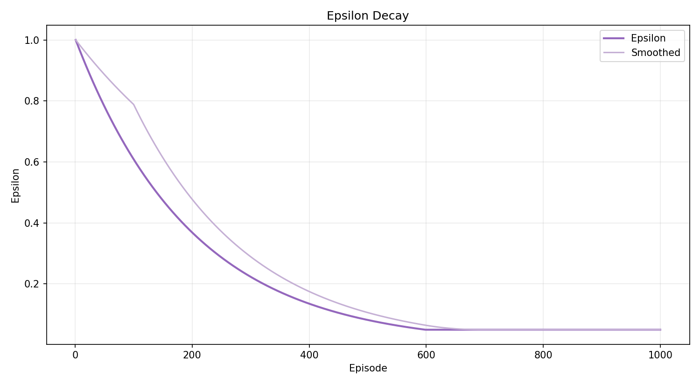                     |                      |

### Training Comparison

The original `agent1` run learned to score more often and ended with a stronger final-100-episode reward curve. The newer V10 `agent2` run used richer state inputs, but the highlighted agent side was more conservative: it survived longer on average while still struggling to convert possessions into goals. This is mainly coused by the old reward system in V6, it is still consistant with old `ACTIONS` and not updates to suit the newly added action, the great gap will be seen in V12 when I update the reward system.

| Last 100 Episodes                          | agent1 run | agent2 V10 run |
| ------------------------------------------ | ---------: | -------------: |
| Highlighted agent average reward           |    `73.67` |       `-26.71` |
| Highlighted agent goals / episode          |     `0.54` |         `0.02` |
| Highlighted agent touches / episode        |     `1.65` |         `1.69` |
| Highlighted agent average distance to ball |   `171.94` |       `210.93` |
| Average episode length                     |    `554.3` |        `719.3` |
| Final epsilon                              |     `0.05` |         `0.05` |

## Output Data

Every logged run creates a folder under:

```text
data/training_runs/<run_name>/
```

Example V10 training output:

```text
data/training_runs/run_YYYYMMDD_HHMMSS/
├── config.json
├── episodes.csv
├── steps.csv              # optional, only with --log-steps
├── checkpoints/
│   ├── episode_000100.pt
│   ├── episode_000200.pt
│   └── final.pt
└── plots/
    ├── rewards.png
    ├── winrate.png
    ├── goals.png
    ├── touches.png
    ├── distance_to_ball.png
    ├── episode_length.png
    └── epsilon.png
```

`episodes.csv` includes episode length, winner, scores, goals, touches, kicks, steals, average distance to ball, total rewards, epsilon, and timestamp.

## Reward Shaping V1

The current reward function is intentionally simple:

| Event                           |  Reward |
| ------------------------------- | ------: |
| Score a goal                    |  `+100` |
| Concede a goal                  |  `-100` |
| Touch the ball                  |    `+2` |
| Ball moves toward opponent goal |  `+0.2` |
| Every step                      | `-0.01` |

Team 1 attacks the right goal. Team 2 attacks the left goal.

## Environment API

```python
from env.soccer_env import ACTION_SPACE_SIZE, SoccerEnv
from agents.random_agent import RandomAgent

env = SoccerEnv(render_mode=None)
agent_1 = RandomAgent()
agent_2 = RandomAgent()

state = env.reset()
done = False

while not done:
    action_1 = agent_1.act()
    action_2 = agent_2.act()
    state, reward_1, reward_2, done, info = env.step(action_1, action_2)

env.close()
```

Actions:

|  ID | Action |
| --: | ------ |
| `0` | Stay   |
| `1` | Up     |
| `2` | Down   |
| `3` | Left   |
| `4` | Right  |
| `5` | Kick   |

## State Representation

V10 expands the environment state from the original compact state to an 18-value vector:

```text
[
  agent_1_x,
  agent_1_y,
  agent_2_x,
  agent_2_y,
  ball_x,
  ball_y,
  ball_vx,
  ball_vy,
  agent_1_distance_to_ball,
  agent_1_angle_to_ball,
  agent_2_distance_to_ball,
  agent_2_angle_to_ball,
  ball_distance_to_agent_1_goal,
  ball_distance_to_agent_2_goal,
  ball_moving_toward_agent_1_goal,
  ball_moving_toward_agent_2_goal,
  last_touch_owner,
  steps,
]
```

`last_touch_owner` is encoded as `0`, `1`, or `2`. Because the DQN input size changed in V10, checkpoints from older state sizes should be retrained before use with the current model.

## Repository Structure

```text
RLStriker/
├── agents/
│   ├── dqn_agent.py
│   ├── model.py
│   ├── random_agent.py
│   └── replay_buffer.py
├── env/
│   ├── constants.py
│   ├── entities.py
│   ├── field.py
│   ├── physics.py
│   ├── rewards.py
│   ├── rules.py
│   ├── soccer_env.py
│   └── state.py
├── logging_utils/
│   ├── episode_logger.py
│   └── metrics.py
├── analysis/
│   ├── plot_all.py
│   ├── plot_goals.py
│   ├── plot_rewards.py
│   ├── plot_touches.py
│   └── plot_winrate.py
├── curriculum/
│   ├── curriculum_manager.py
│   └── stages.py
├── data/
│   └── training_runs/
├── main.py
├── run_random.py
├── train.py
├── requirements.txt
└── README.md
```

## Development Roadmap

- V11: Self-play against older checkpoints
- V12: More detailed soccer rewards and reward components
- V13: Demo mode for trained models
- V14: Human vs AI mode
- V15: Multi-agent 2v2 expansion
- V16: Final portfolio polish

## License

MIT. See [LICENSE](LICENSE).
